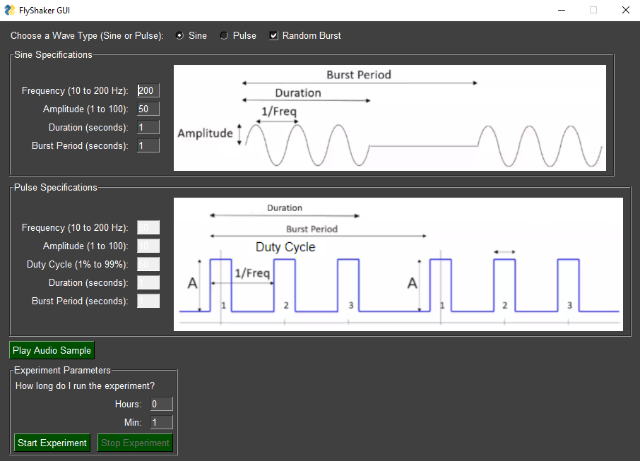
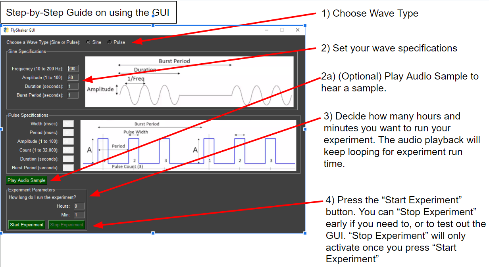

# FlyShakerGUI

FlyShaker GUI Code for control of the audio wave generation device developed
by Thomas Zimmerman (IBM, CCC) for use in Dr. Divya Sitaraman's lab at CSU East Bay.

*Note*: Go to **Quickstart** if you want to start using the GUI without any explanations.
If you want explanations and reasoning, read the rest of the sections.

## Outline
- Changelog
- Quickstart
- Introduction
- Library Dependencies
- Setup/Install Dependencies
- Which version to use?
- How to Use GUI?
- Possible Future Updates

## Changelog
4-8-2023: Made version 2 of GUI with Random Burst mode selection,
          made Pulse Specs match Sine Specs, but with Duty Cycle 
3-18-2023: Added more to Readme. GUI Version 1 complete, ready for testing. 

## Quickstart (no explanation)

1. From commandline: pip install -r requirements.txt
2. run FlyShakerGUI_v1a.py, make sure module_wave_gen.py is in the same folder as the GUI.

## Introduction

As of 3-18-2023, version 1 of the GUI is complete.
I've modularized Tom's Code (refer to Tom_Code folder) into the module_wave_gen.py file.

Every time a new version is created, I will make a copy of it, then add the version number.
Note to GitHub users, I am breaking the preferred methods,
I wanted as easily accessible versions listed for non-experienced GitHub users
(this includes me, I'm not well versed with GitHub yet).

For example, I will no longer update v1a. Exception, I will update v1b once I work on it.
Consider FlyShakerGUI to be the "working" GUI version.

## File Explanations

### module_wave_gen.py
The module based on Tom's code that generates sine and pulse wave
based on different variables. You **need** this to run any of the GUI files.

Contains a main() so that a user may test the functions individually
when running the module only.

### FlyShakerGUI.py
The current working GUI file, future updates will go here.
However, as of 3-18-2023, is identical to v1a and v1b.

### FlyShakerGUI_v1a.py
The completed version 1 that has Pulse Wave Specifications:
width, period, amplitude, count, burst period, and duration (not in any specific order).
This the original GUI requirements. Use this GUI file if you want to use version 1 that works.
As of 3-18-2023, all GUI files are the same. This will change once I add stuff to v1b.

### FlyShakerGUI_v1a.py
Same as v1a, as of 3-18-2023. The plan is to change the GUI Pulse Wave specifications to
remove period and width, and changing count to frequency. As the SciPy library uses
frequency to generate a square wave (or pulse wave). Additionally, period and width are used
to calculate duty cycle in version 1, so I propose to remove that and only use "duty cycle"
as a pulse wave specification. So the proposed Pulse Wave Specifications are:
amplitude, duty cycle, frequency, burst period, and duration (not in any specific order).

*Note*: I have not used the preferred GitHub style of commits
(branching for modules and other files). Think of this as more of a
Google Doc history, except with a folder.

## Library Dependencies

The main libraries used are:
- PySimpleGUI (for easy GUI creation)
- pygame (easy wave audio playback)
- numpy (sine wave creation and other array manipulation)
- SciPy (using the square wave signal function to generate pulse waves)
- matplotlib (for troubleshooting wave generation, am I actually creating a sine or pulse wave?)

## Setup/Install Dependencies

To install the dependencies using Windows,
download the entire GitHub repo to your desired location, then use the requirements.txt file;
like so:

`pip install -r requirements.txt`

Sources:
- [Geek For Geeks Link](https://www.geeksforgeeks.org/how-to-install-python-packages-with-requirements-txt/)
- [StackOverFlow Link](https://stackoverflow.com/questions/66899666/how-to-install-from-requirements-txt)

*Note*: This is untested for Mac and Linux,
so I won't be able to help with installing or usage there.
I did attempt to use the OS library to make things OS independent for file grabbing,
but it is untested.

## Which Version to Use?
Use version 1a, or FlyShakerGUI_v1a.py.

## How to Use GUI?

## Possible Future Updates
- Randomized Burst Period selection
- Save/Load wave specifications from a file.

